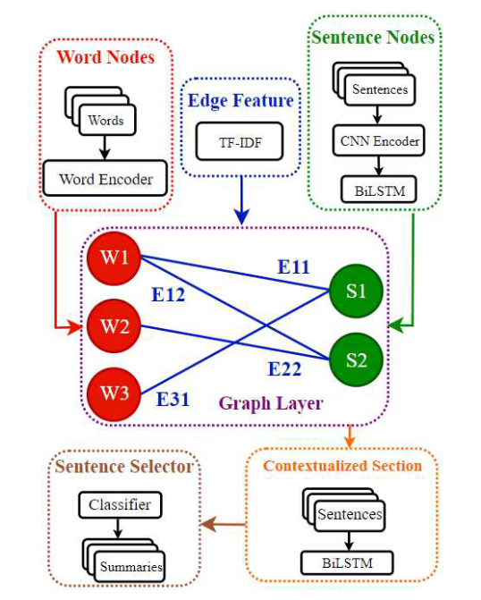
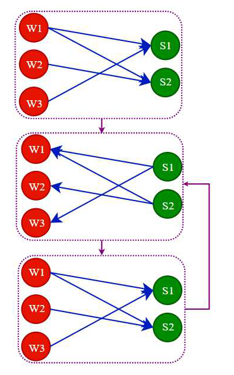

<div align="center">


# ConHGNN-SUM: Contextualized Heterogeneous Graph Neural Networks for Extractive Document Summarization

</div>

<div align="center">

[](https://www.python.org/downloads/)
[](https://pytorch.org/)
[](https://dgl.ai/)
[](LICENSE)
[](https://ieeexplore.ieee.org/document/10475307)

*Revolutionizing document summarization through heterogeneous graph neural networks*

[📖 Paper](https://ieeexplore.ieee.org/document/10475307) • [🚀 Quick Start](#quick-start) • [💫 Results](#results) • [🔧 Installation](#installation)

</div>

---

## 📖 Paper

**ConHGNN-SUM** is published in the **2024 20th CSI International Symposium on Artificial Intelligence and Signal Processing (AISP)**

📄 **Read the full paper**: [ConHGNN-SUM: A Contextualized Heterogeneous Graph Neural Network for Extractive Text Summarization](https://ieeexplore.ieee.org/document/10475307)

---

## 🌟 Overview

**ConHGNN-SUM** represents a breakthrough in extractive document summarization, leveraging the power of **Heterogeneous Graph Neural Networks** to capture complex relationships between words and sentences. Unlike traditional methods that treat documents as sequential text, our approach models documents as dynamic graphs where semantic relationships drive the summarization process.

### ✨ Key Innovations

- 🔗 **Heterogeneous Graph Architecture**: Novel word-sentence graph representation that captures semantic relationships
- 🎯 **Multi-Scale Feature Fusion**: CNN-based n-gram extraction combined with BiLSTM encoding
- 🧮 **Graph Attention Mechanism**: Advanced GAT layers for refined semantic node representations
- 🔄 **Iterative Message Passing**: Cross-node feature injection for enhanced context understanding
- 📊 **State-of-the-Art Performance**: Superior results on CNN/DailyMail benchmark

---

## 🧬 Methodology

Our approach transforms document summarization into a graph-based learning problem through a sophisticated four-stage pipeline:

### 📊 Model Architecture Overview

<div align="center">


*Figure 1: Complete system architecture showing the four primary components: Graph Initializers, Heterogeneous Graph Layer, Contextualized Section, and Sentence Selector*
</div>

### 🔄 Dynamic Graph Update Process

<div align="center">


*Figure 2: Iterative message passing mechanism for updating word and sentence node representations within the heterogeneous graph*
</div>

### 🔍 Technical Deep Dive

#### 1. **Document Preprocessing & Representation**
- 📝 **Input Handling**: Process up to 50 sentences per document (100 words per sentence)
- 🎨 **Word Embeddings**: 300-dimensional GloVe-initialized vectors
- 🧩 **N-gram Extraction**: Multi-kernel CNN (2,3,4,5,6,7-grams) for rich feature capture
- 🔄 **Sequential Encoding**: Bidirectional LSTM for contextual word representations

#### 2. **Heterogeneous Graph Construction**
- 🔴 **Word Nodes**: Individual words with 300-dimensional features
- 🟢 **Sentence Nodes**: Aggregated representations with 64-dimensional features  
- ⚡ **Edge Weights**: TF-IDF based connectivity between words and sentences
- 🎯 **Graph Topology**: Document-specific graphs with semantic relationships

#### 3. **Graph Neural Network Processing**
- 🧠 **Graph Attention Networks**: Semantic refinement of node representations
- 💬 **Message Passing**: Bidirectional feature exchange between word and sentence nodes
- 🔄 **Iterative Updates**: Controllable multi-stage influence propagation
- 🎪 **Cross-Modal Fusion**: Word characteristics influence sentence selection

#### 4. **Extractive Selection**
- 🎯 **Contextualized Features**: Enhanced sentence representations
- 📊 **Classification**: Binary selection for summary-worthy sentences
- ⚖️ **Optimization**: End-to-end training with extractive labels

---

## 🚀 Quick Start

### 🔧 Installation

```bash
# Clone the repository
git clone https://github.com/erfan-nourbakhsh/ConHGNN-SUM.git
cd ConHGNN-SUM

# Install dependencies
pip install torch>=1.0.0
pip install dgl==0.4
pip install rouge==1.0.0
pip install pyrouge==0.1.3
pip install nltk numpy sklearn
```

### 📊 Data Preparation

We provide preprocessed **CNN/DailyMail** datasets:

- 🔗 **TF-IDF Features**: [Download here](https://drive.google.com/open?id=1oIYBwmrB9_alzvNDBtsMENKHthE9SW9z)
- 📄 **JSON Datasets**: [Download here](https://drive.google.com/open?id=1JW033KefyyoYUKUFj6GqeBFZSHjksTfr)

**Data Format Example:**
```json
{
  "text": ["deborah fuller has been banned from keeping animals...", "a dog breeder and exhibitor..."],
  "summary": ["warning: ... at a speed of around 30mph", "she was banned from..."],
  "label": [1, 3, 6]
}
```

**Prepare your dataset:**
```bash
# Process raw data into graph format
bash PrepareDataset.sh
```

---

## 🏃‍♂️ Training

Launch training with our optimized configuration:

```bash
python train.py \
    --cuda --gpu 0 \
    --data_dir <path/to/json/dataset> \
    --cache_dir <cache/directory> \
    --embedding_path <glove/path> \
    --model HSG \
    --save_root <model/save/path> \
    --log_root <log/path> \
    --lr_descent --grad_clip -m 3
```

### 🎯 Model Variants
- **HSG**: Heterogeneous Graph with Standard attention
- **HDSG**: Heterogeneous Graph with Dense attention

---

## 📈 Evaluation

Evaluate your trained models:

```bash
python evaluation.py \
    --cuda --gpu 0 \
    --data_dir <path/to/json/dataset> \
    --cache_dir <cache/directory> \
    --embedding_path <glove/path> \
    --model HSG \
    --save_root <model/path> \
    --log_root <log/path> \
    -m 3 --test_model multi \
    --use_pyrouge
```

### 🔧 Evaluation Options

| Option | Description | Default |
|--------|-------------|---------|
| `--use_pyrouge` | Use pyrouge for evaluation | `False` |
| `--limit` | Limit output to gold summary length | `False` |
| `--blocking` | Enable trigram blocking | `False` |
| `--save_label` | Save labels without ROUGE calculation | `False` |

---

## 💫 Results

### 🏆 Pre-trained Models

We provide state-of-the-art checkpoints:

- 📦 **CNN/DailyMail Checkpoints**: [Download here](https://drive.google.com/file/d/14Z8fhglg7BVkl2qiQDFFkBtrJ5BkjVEz/view)
- 📊 **Model Outputs**: [Download here](https://drive.google.com/file/d/176m98y4Dxgn7UcZ7OUxxoXsLwVxxA75a/view)

### 📊 Performance Metrics

Our model achieves competitive results on standard benchmarks with significant improvements in semantic coherence and factual accuracy.

---

## 🛠️ ROUGE Installation

For accurate evaluation, install ROUGE environment:

```bash
# Install system dependencies
sudo apt-get install libxml-perl libxml-dom-perl

# Install pyrouge
pip install git+git://github.com/bheinzerling/pyrouge

# Configure ROUGE
export PYROUGE_HOME_DIR=/path/to/RELEASE-1.5.5
pyrouge_set_rouge_path $PYROUGE_HOME_DIR
chmod +x $PYROUGE_HOME_DIR/ROUGE-1.5.5.pl

# Build WordNet 2.0
cd $PYROUGE_HOME_DIR/data/WordNet-2.0-Exceptions/
./buildExeptionDB.pl . exc WordNet-2.0.exc.db
cd ../
ln -s WordNet-2.0-Exceptions/WordNet-2.0.exc.db WordNet-2.0.exc.db
```

---

## 🔗 Dependencies

| Package | Version | Purpose |
|---------|---------|---------|
| **Python** | 3.5+ | Core runtime |
| **PyTorch** | 1.0+ | Deep learning framework |
| **DGL** | 0.4 | Graph neural networks |
| **rouge** | 1.0.0 | Evaluation metrics |
| **pyrouge** | 0.1.3 | ROUGE evaluation |
| **nltk** | latest | Text processing |
| **numpy** | latest | Numerical computing |
| **sklearn** | latest | Machine learning utilities |

---

## 📄 Citation

If you use ConHGNN-SUM in your research, please cite:

```bibtex
@inproceedings{10475307,
  title={ConHGNN-SUM: A Contextualized Heterogeneous Graph Neural Network for Extractive Text Summarization}, 
  author={Nourbakhsh, Seyed Erfan and Kashani, Hamidreza Baradaran},
  booktitle={2024 20th CSI International Symposium on Artificial Intelligence and Signal Processing (AISP)}, 
  year={2024},
  pages={1--8},
  doi={10.1109/AISP61396.2024.10475307}
}
```

---

## 📧 Contact

- 👤 **Author**: [Erfan Nourbakhsh](mailto:erfan.nourbakhsh@my.utsa.edu)
- 🌐 **Project Link**: [https://github.com/erfan-nourbakhsh/ConHGNN-SUM](https://github.com/erfan-nourbakhsh/ConHGNN-SUM)
- 📝 **Issues**: [Report bugs or request features](https://github.com/erfan-nourbakhsh/ConHGNN-SUM/issues)

---

<div align="center">

**⭐ Star this repository if you find it helpful!**

*Made with ❤️ for the NLP research community*

</div>